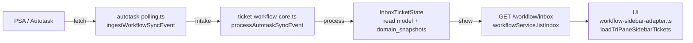

# Title
Canonical Flow Audit: Fetch -> Intake -> Process -> Show (Only Active Flow)

# What changed
- Performed a full-path audit from Autotask ingestion to UI rendering and confirmed the canonical pipeline is the only active ticket flow.
- Removed dead code in `autotask-route-handlers.ts` tied to the deprecated `/autotask/sidebar-tickets` direct-fetch path.
- Removed stale tests that validated the removed legacy sidebar path.
- Kept `/autotask/sidebar-tickets` as an explicit HTTP 410 deprecated stub.

# Why it changed
- Enforce strict architectural clarity: only canonical read-model data is used by UI.
- Eliminate unreachable legacy logic that added maintenance overhead and test noise.
- Reduce risk of accidental reactivation of non-canonical data paths.

# Impact (UI / logic / data)
- UI: no behavior change; UI already consumed `/workflow/inbox` exclusively.
- Logic: removed unused legacy sidebar-fetch/degradation/coordination code paths.
- Data: no schema or runtime data contract changes; canonical pipeline remains unchanged.

# Files touched
- `apps/api/src/services/application/route-handlers/autotask-route-handlers.ts`
- `apps/api/src/__tests__/routes/autotask.sidebar-tickets.test.ts` (deleted)
- `apps/api/src/__tests__/routes/autotask.sidebar-tickets.degradation.test.ts` (deleted)
- `apps/api/src/__tests__/services/autotask-route-handlers.sidebar-coordination.test.ts` (deleted)
- `wiki/architecture/canonical-flow-audit.md`

# Date
2026-03-05
